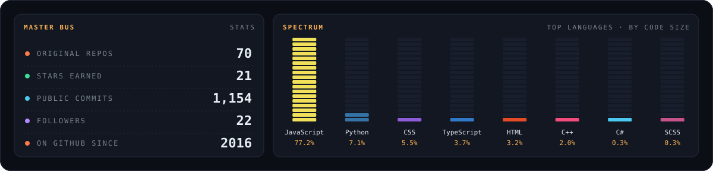

<!--
  🎧 Reading the source? Hi there!
  The graphics in assets/ are generated by scripts/build.mjs (zero dependencies)
  and a GitHub Action re-records them every night from my public repos.
-->


<p align="center">
  <b>Creative developer.</b> I build instruments that make sound, games that run in the browser<br/>
  and simulations that, every now and then, do things I didn't plan for.
</p>

## 🎚️ Session View


<details>
<summary><b>Open the mixer</b> — every project, clickable</summary>
<br/>

<!-- MIXER:START -->

**🎛️ AUDIO** — [DAW_2026](https://github.com/davvoz/DAW_2026) · [audiorecorder](https://github.com/davvoz/audiorecorder) · [audiofx](https://github.com/davvoz/audiofx) · [Advanced-Web-Audio-API-Playground](https://github.com/davvoz/Advanced-Web-Audio-API-Playground) · [pythondaw](https://github.com/davvoz/pythondaw) · [AdvancedWebAudioPlaygroundAngular](https://github.com/davvoz/AdvancedWebAudioPlaygroundAngular) · [youtube_mixer](https://github.com/davvoz/youtube_mixer) · [ableton-session-clone](https://github.com/davvoz/ableton-session-clone) · [Test-daw-1](https://github.com/davvoz/Test-daw-1) · [ableton-angular-daw](https://github.com/davvoz/ableton-angular-daw) · [piano-roll](https://github.com/davvoz/piano-roll) · [Audio-visualizer](https://github.com/davvoz/Audio-visualizer) · [music_studio](https://github.com/davvoz/music_studio) · [studio_dsp](https://github.com/davvoz/studio_dsp) · [sequencer](https://github.com/davvoz/sequencer) · [-seq](https://github.com/davvoz/-seq) · [beat-box-app](https://github.com/davvoz/beat-box-app) · [BeatBoxi](https://github.com/davvoz/BeatBoxi) · [Seqanco](https://github.com/davvoz/Seqanco) · [Distaseqa](https://github.com/davvoz/Distaseqa)

**🕹️ GAMES** — [Ggameplatform](https://github.com/davvoz/Ggameplatform) · [magic8-tcg](https://github.com/davvoz/magic8-tcg) · [magic8](https://github.com/davvoz/magic8) · [fantasygame](https://github.com/davvoz/fantasygame) · [cannone](https://github.com/davvoz/cannone) · [steemplatformgame2](https://github.com/davvoz/steemplatformgame2) · [game-of-life](https://github.com/davvoz/game-of-life) · [space-station](https://github.com/davvoz/space-station) · [Arkanoid-by-gpt-3](https://github.com/davvoz/Arkanoid-by-gpt-3) · [provagame](https://github.com/davvoz/provagame) · [pravagame2022](https://github.com/davvoz/pravagame2022) · [monopoli](https://github.com/davvoz/monopoli) · [tddMonopoli](https://github.com/davvoz/tddMonopoli)

**⛓️ WEB3** — [cur8fun](https://github.com/davvoz/cur8fun) · [cur8showcase](https://github.com/davvoz/cur8showcase) · [steemly](https://github.com/davvoz/steemly) · [mr_steem](https://github.com/davvoz/mr_steem) · [cur8hive](https://github.com/davvoz/cur8hive) · [cur8](https://github.com/davvoz/cur8) · [cur8-steem-telegram](https://github.com/davvoz/cur8-steem-telegram) · [steem-sniper](https://github.com/davvoz/steem-sniper) · [faucet_cyber](https://github.com/davvoz/faucet_cyber) · [steem-animals](https://github.com/davvoz/steem-animals) · [primoWEB3](https://github.com/davvoz/primoWEB3)

**✨ GENERATIVE** — [reality](https://github.com/davvoz/reality) · [proprietaemergenti](https://github.com/davvoz/proprietaemergenti) · [ai_text_studio_by_luciogiolli](https://github.com/davvoz/ai_text_studio_by_luciogiolli) · [canvasfwk](https://github.com/davvoz/canvasfwk) · [image_generator](https://github.com/davvoz/image_generator) · [VisualFXs](https://github.com/davvoz/VisualFXs) · [Deforum_Stable_Diffusion_Davvoz](https://github.com/davvoz/Deforum_Stable_Diffusion_Davvoz) · [digital-clock-by-codex-an-me](https://github.com/davvoz/digital-clock-by-codex-an-me) · [nice-shapes-and-poligons-by-codex-and-me](https://github.com/davvoz/nice-shapes-and-poligons-by-codex-and-me) · [all-in-a-canvas-knob-by-codex-and-me](https://github.com/davvoz/all-in-a-canvas-knob-by-codex-and-me) · [Colonia-by-Codex-and-me](https://github.com/davvoz/Colonia-by-Codex-and-me) · [FallingElements](https://github.com/davvoz/FallingElements)

<!-- MIXER:END -->

</details>

## 💿 Tracklist

**Side A — sound**

- `A1` **[DAW_2026](https://github.com/davvoz/DAW_2026)** — an open-source DAW in C++20, built one phase at a time
- `A2` **[Advanced Web Audio API Playground](https://github.com/davvoz/Advanced-Web-Audio-API-Playground)** — a modular synth in the browser: drag the modules, patch the cables, play

**Side B — worlds**

- `B1` **[proprietaemergenti](https://github.com/davvoz/proprietaemergenti)** — particles learning to be alive: emergent behaviour on WebGPU compute shaders
- `B2` **[reality](https://github.com/davvoz/reality)** — GPU physics simulations in WebGL2, vanilla JavaScript, zero dependencies
- `B3` **[magic8](https://github.com/davvoz/magic8)** — a strategic card game engine, drawn entirely on Canvas
- `B4` **[Ggameplatform](https://github.com/davvoz/Ggameplatform)** — a platform for HTML5 games with sandboxed iframes and real-time messaging

**Bonus track — on-chain**

- `C1` **[cur8.fun](https://cur8.fun)** — a modern interface for the Steem blockchain, live and in use

## 📈 Meters



<p align="center">
  
</p>

## 📝 Liner notes

```text
Produced, written & debugged by .......... davvoz
Co-writers ............................... Codex, GPT-3, Claude and a few other passing AIs
Recorded at .............................. GitHub, 2017 → today
Mixed with ............................... JavaScript · TypeScript · C++ · Python

No semicolons were harmed during the making of this record.*
* maybe one.
```


