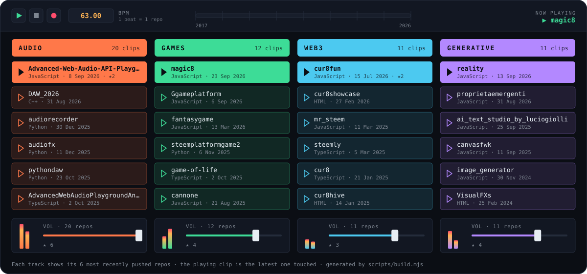

<!--
  🎧 Stai leggendo il sorgente? Ciao!
  Le grafiche in assets/ sono generate da scripts/build.mjs (zero dipendenze)
  e una GitHub Action le riregistra ogni notte a partire dai miei repo pubblici.
-->



<p align="center">
  <b>Sviluppatore creativo.</b> Costruisco strumenti che suonano, giochi che girano nel browser<br/>
  e simulazioni che, a volte, fanno cose che non avevo previsto.
</p>

## 🎚️ Session View



<details>
<summary><b>Apri il mixer</b> — tutti i progetti, cliccabili</summary>
<br/>

<!-- MIXER:START -->

**🎛️ AUDIO** — [DAW_2026](https://github.com/davvoz/DAW_2026) · [audiorecorder](https://github.com/davvoz/audiorecorder) · [audiofx](https://github.com/davvoz/audiofx) · [Advanced-Web-Audio-API-Playground](https://github.com/davvoz/Advanced-Web-Audio-API-Playground) · [pythondaw](https://github.com/davvoz/pythondaw) · [AdvancedWebAudioPlaygroundAngular](https://github.com/davvoz/AdvancedWebAudioPlaygroundAngular) · [youtube_mixer](https://github.com/davvoz/youtube_mixer) · [ableton-session-clone](https://github.com/davvoz/ableton-session-clone) · [Test-daw-1](https://github.com/davvoz/Test-daw-1) · [ableton-angular-daw](https://github.com/davvoz/ableton-angular-daw) · [piano-roll](https://github.com/davvoz/piano-roll) · [Audio-visualizer](https://github.com/davvoz/Audio-visualizer) · [music_studio](https://github.com/davvoz/music_studio) · [studio_dsp](https://github.com/davvoz/studio_dsp) · [sequencer](https://github.com/davvoz/sequencer) · [-seq](https://github.com/davvoz/-seq) · [beat-box-app](https://github.com/davvoz/beat-box-app) · [BeatBoxi](https://github.com/davvoz/BeatBoxi) · [Seqanco](https://github.com/davvoz/Seqanco) · [Distaseqa](https://github.com/davvoz/Distaseqa)

**🕹️ GAMES** — [magic8](https://github.com/davvoz/magic8) · [Ggameplatform](https://github.com/davvoz/Ggameplatform) · [fantasygame](https://github.com/davvoz/fantasygame) · [cannone](https://github.com/davvoz/cannone) · [steemplatformgame2](https://github.com/davvoz/steemplatformgame2) · [game-of-life](https://github.com/davvoz/game-of-life) · [space-station](https://github.com/davvoz/space-station) · [Arkanoid-by-gpt-3](https://github.com/davvoz/Arkanoid-by-gpt-3) · [provagame](https://github.com/davvoz/provagame) · [pravagame2022](https://github.com/davvoz/pravagame2022) · [monopoli](https://github.com/davvoz/monopoli) · [tddMonopoli](https://github.com/davvoz/tddMonopoli)

**⛓️ WEB3** — [cur8fun](https://github.com/davvoz/cur8fun) · [cur8showcase](https://github.com/davvoz/cur8showcase) · [steemly](https://github.com/davvoz/steemly) · [mr_steem](https://github.com/davvoz/mr_steem) · [cur8hive](https://github.com/davvoz/cur8hive) · [cur8](https://github.com/davvoz/cur8) · [cur8-steem-telegram](https://github.com/davvoz/cur8-steem-telegram) · [steem-sniper](https://github.com/davvoz/steem-sniper) · [faucet_cyber](https://github.com/davvoz/faucet_cyber) · [steem-animals](https://github.com/davvoz/steem-animals) · [primoWEB3](https://github.com/davvoz/primoWEB3)

**✨ GENERATIVE** — [reality](https://github.com/davvoz/reality) · [proprietaemergenti](https://github.com/davvoz/proprietaemergenti) · [ai_text_studio_by_luciogiolli](https://github.com/davvoz/ai_text_studio_by_luciogiolli) · [canvasfwk](https://github.com/davvoz/canvasfwk) · [image_generator](https://github.com/davvoz/image_generator) · [VisualFXs](https://github.com/davvoz/VisualFXs) · [Deforum_Stable_Diffusion_Davvoz](https://github.com/davvoz/Deforum_Stable_Diffusion_Davvoz) · [digital-clock-by-codex-an-me](https://github.com/davvoz/digital-clock-by-codex-an-me) · [nice-shapes-and-poligons-by-codex-and-me](https://github.com/davvoz/nice-shapes-and-poligons-by-codex-and-me) · [all-in-a-canvas-knob-by-codex-and-me](https://github.com/davvoz/all-in-a-canvas-knob-by-codex-and-me) · [Colonia-by-Codex-and-me](https://github.com/davvoz/Colonia-by-Codex-and-me) · [FallingElements](https://github.com/davvoz/FallingElements)

<!-- MIXER:END -->

</details>

## 💿 Tracklist

**Lato A — suono**

- `A1` **[DAW_2026](https://github.com/davvoz/DAW_2026)** — una DAW open source in C++20, costruita una fase alla volta
- `A2` **[Advanced Web Audio API Playground](https://github.com/davvoz/Advanced-Web-Audio-API-Playground)** — synth modulare nel browser: trascini i moduli, colleghi i cavi, suona

**Lato B — mondi**

- `B1` **[proprietaemergenti](https://github.com/davvoz/proprietaemergenti)** — particelle che imparano a vivere: comportamenti emergenti su compute shader WebGPU
- `B2` **[reality](https://github.com/davvoz/reality)** — simulazioni fisiche su GPU in WebGL2, JavaScript puro, zero dipendenze
- `B3` **[magic8](https://github.com/davvoz/magic8)** — motore per un card game strategico, disegnato interamente su Canvas
- `B4` **[Ggameplatform](https://github.com/davvoz/Ggameplatform)** — piattaforma per giochi HTML5 con iframe isolati e comunicazione in tempo reale

**Bonus track — on-chain**

- `C1` **[cur8.fun](https://cur8.fun)** — un'interfaccia moderna per la blockchain Steem, online e in uso

## 📈 Meter

<p align="center">
  
  
</p>
<p align="center">
  
</p>

## 📝 Liner notes

```text
Prodotto, scritto e debuggato da ......... davvoz
Co-autori ................................ Codex, GPT-3, Claude e altre AI di passaggio
Registrato su ............................ GitHub, 2017 → oggi
Mixato con ............................... JavaScript · TypeScript · C++ · Python

Nessun punto e virgola è stato maltrattato durante la registrazione.*
* forse uno.
```


